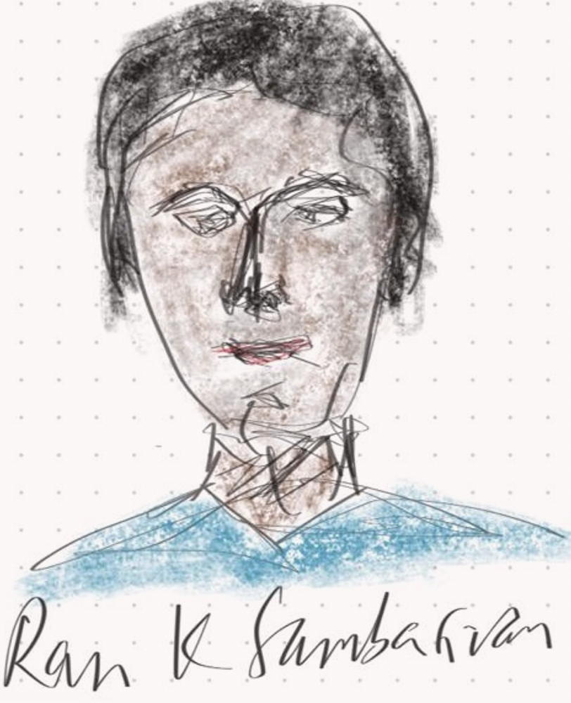
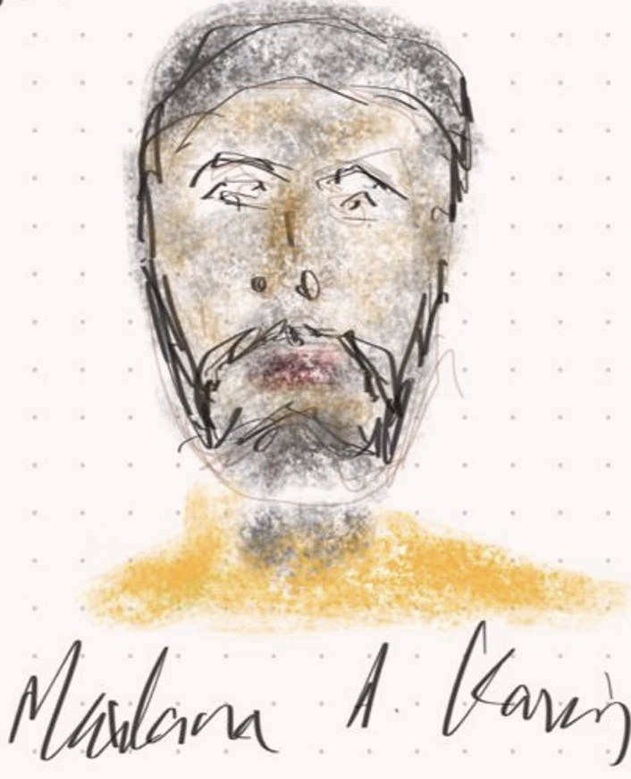

*Course-Based Undergraduate Research Experiences with Pathogen Data*

# About the workshop
The PDN CUREs Workshop was held March 23–25, 2026, at Cold Spring Harbor Laboratory in New York, USA, to support the development of curriculum resources and competencies for the education and training of the infectious-disease workforce. The workshop was developed in response to growing demand for educational materials that prepare students for careers involving infectious disease research, public health, laboratory science, bioinformatics, and related fields.
The workshop was announced internationally and attracted more than 100 applicants. A competitive cohort of educators, researchers, bioinformaticians, public health specialists, and industry representatives was selected to participate. Attendees represented a broad range of expertise, including microbiology, genomics, One Health, bioinformatics, undergraduate education, workforce training, and laboratory operations.

The workshop brought together participants from universities, community colleges, research institutes, public health-oriented organizations, industry, and international training programs. These broad perspectives were essential for ensuring that resulting materials would be relevant across multiple career paths and educational settings, including undergraduate education, workforce training, clinical and public health contexts, and laboratory research.
Rationale for Undergraduate-Focused Training

Although NIH's emphasis on trainee preparation generally targets the graduate level, choosing undergraduate education as the baseline provides several advantages. Focusing on introductory experiences allowed participants to develop materials that support many future career pathways, including clinical care, diagnostics, public health, surveillance, biotechnology, pharmaceutical and applied research, and basic research. Course-based Undergraduate Research Experiences (CUREs) provide an evidence-based and highly effective model for building the foundational skills, competencies, and habits of mind needed for infectious disease careers.

Undergraduate-focused resources can also engage students outside elite research institutions, including at community colleges, regional public universities, rural institutions, and other settings that may have fewer resources. This is especially important because future workforce needs will require talent from a much wider range of educational backgrounds and geographic regions.
The resulting competency framework serves as a foundation for learners at later career stages. Graduate students, postdoctoral fellows, clinical laboratory personnel, public health professionals, and other advanced learners can also benefit from the competency framework and modular training resources developed through this effort.

## Competencies Working Group

The Competencies Working Group focused on defining the broad competencies needed for future success in pathogen-related fields. Participants emphasized that competencies should be appropriate for undergraduate learners while remaining relevant to workforce needs.

The group initially assembled more than 100 competency ideas spanning laboratory skills, project management, bioinformatics, ethics, data analysis, and professional skills. Participants agreed that these should eventually be refined into a smaller, more manageable set of approximately 30 high-level competencies.

Key competency domains identified by the group included:
Core project and teamwork skills
Experimental design and project management
Pathogen biology and microbiology
Laboratory and sequencing methods
Bioinformatics and data analysis
Statistics and interpretation
Artificial intelligence, automation, and responsible use of AI tools
Ethics, privacy, and trust
Communication and science communication
Career-spanning learning and workforce readiness

### Draft Competencies

<iframe
  src="https://docs.google.com/spreadsheets/d/e/2PACX-1vQZhqQHS7-tPcvQqtTkTi9wd3-GsQsBjUr4y-V5y2H05rNrC8_fmR0FPW8qQ4txwNBtohsoq64TbaVT/pubhtml?gid=92281840&single=true&widget=true&headers=false"
  width="100%"
  height="1600"
  style="border:none;">
</iframe>

## Career track personas

The group also discussed the importance of developing personas that reflect common career pathways, such as laboratory technicians, bioinformatics analysts, public health staff, clinical laboratory personnel, undergraduate researchers, and biotechnology employees. These personas will help ensure that competencies are relevant to real-world workforce roles.

### Healthcare Track (Public Health Professional / Clinical Scientist)

This track is designed for students interested in applying pathogen genomics in healthcare and public health settings. It brings together perspectives from public health and clinical science, focusing on how genomic data can inform disease surveillance, diagnostics, and patient care. It focuses on exploring how pathogen data moves from laboratory generation to real-world decision-making, developing skills to interpret and communicate findings in ways that support outbreak response, healthcare systems, and community health outcomes.

Examples of professionals related to this track: policy-makers, epidemiologists, data modeling analysts, physicians, nurses, allied health professionals, clinical scientists, laboratory scientists, among others.

#### Florence N. Smith - Public Health Professional

  

**Qualification and background**

- BSc in Nursing
- MSc in Global Health
- Field internship at the Ministry of Health

Florence's academic path began with an interest in community health and disease prevention. During her undergraduate studies, she developed skills in epidemiology and biostatistics, alongside a growing awareness of infectious disease dynamics. Exposure to outbreak investigations and surveillance programs sparked an interest in integrating genomic data into public health decision-making. Her training increasingly combined traditional epidemiology with data analysis and interpretation of pathogen genomics.

**Activities of current role**

- Monitoring infectious disease trends through surveillance systems
- Analysing epidemiological and genomic datasets
- Supporting outbreak investigation and response activities
- Preparing reports and data summaries for public health stakeholders
- Collaborating with laboratories and research institutions
- Contributing to data-informed policy discussions

Florence’s work within the Ministry of Health supports the integration of pathogen genomics into routine surveillance. Her work focuses on translating complex datasets into actionable insights that inform public health responses and preparedness strategies.

#### Paul E. Johnson - Clinical Scientist

  

**Qualification and background**

-	BSc in Biomedical Science
-	Clinical training programme in laboratory medicine
-	Hospital diagnostic laboratory placement

Paul’s training began with a strong foundation in laboratory sciences and human health. During his studies, he developed practical skills in microbiology, molecular biology, and diagnostic techniques. Exposure to clinical settings introduced him to pathogen detection and patient-centered applications of laboratory work. Increasingly, he gained experience with sequencing technologies and genomic data interpretation as part of cutting-edge diagnostics methods.

**Activities of current role**

-	Processing clinical samples for pathogen detection and sequencing
-	Performing and validating molecular diagnostic assays
-	Interpreting genomic data in a clinical context
-	Ensuring laboratory quality control and compliance
-	Communicating results to clinicians and healthcare teams
-	Supporting infection control and surveillance efforts

Paul’s work in hospital laboratories contributes to the accurate and timely diagnosis of infectious diseases. His role connects laboratory data with patient care, with growing involvement in integrating genomics into routine diagnostics.

### Research Track (Basic Research Scientist / Applied Research Scientist)

This track is aimed at students interested in advancing pathogen genomics through research and innovation. It combines foundational biological inquiry with practical, data-driven approaches, spanning both basic and applied science. It focuses on engaging with questions about pathogen biology, evolution, and function, while also developing computational and analytical skills to work with genomic data. The track encourages students to explore how research discoveries can be translated into tools, methods, and knowledge that strengthen our understanding and management of infectious diseases.

#### Gregor M. Williams - Basic Research Scientist

  

**Qualification and background**

-	BSc in Genetics
-	PhD in Microbial Genetics
-	Undergraduate research project in pathogen drug resistance

Gregor’s academic journey was driven by curiosity about how pathogens function and evolve. During undergraduate training, he gained experience in laboratory experimentation and theoretical concepts such as gene regulation, mutation, and host–pathogen interactions. Research projects deepen his interest in understanding mechanisms at the molecular level, often leading to further research training.

**Activities of current role**

-	Designing and conducting experiments on pathogen systems
-	Analysing genomic and molecular datasets
-	Performing genome annotation and comparative analyses
-	Investigating mutations and their functional impact
-	Collaborating with interdisciplinary research teams

Gregor’s work in academic and research institute settings focuses on fundamental questions in pathogen biology. His work contributes to the broader scientific understanding that underpins advances in diagnostics, therapeutics, and surveillance.

#### Rosalind F. Brown - Applied Research Scientist

  

**Qualification and background**

-	BSc in Computational Biology
-	MSc in Genomics
-	Undergraduate experience in coding (e.g., Python/R) and data analysis

Rosalind’s background is interdisciplinary, combining an interest in biology with computational problem-solving. During her studies, she developed skills in programming, statistics, and data analysis, often applied to biological questions. Exposure to genomics datasets and sequencing technologies led her to focus on developing tools and workflows for analyzing pathogen data.

**Activities of current role**

-	Developing and running bioinformatics pipelines
-	Performing genome assembly, annotation, and quality control
-	Managing datasets using FAIR principles
-	Creating reproducible workflows and documentation
-	Collaborating with laboratory and public health teams
-	Supporting tool development and data integration

Rosalind works at the interface of biology and data science, translating complex genomic data into usable outputs. Her role is central to making pathogen genomics scalable, reproducible, and accessible across different research and public health contexts.

### Industry Track (Pathogen Data Scientist)

This track is designed for students interested in applying pathogen genomics in industry settings. It brings together perspectives from public health and clinical science, focusing on how genomics and real world data can inform disease surveillance, diagnostics, and patient care. It focuses on exploring how pathogen data in industrial settings leads to real-world decision-making, developing skills to interpret and communicate findings in ways that support diagnostic test development, outbreak response, healthcare systems, and community health outcomes.

Examples of professionals related to this track: Genomics and pathogen data scientists with varied backgrounds actively involved in analyzing real world data for pathogen surveillance, develop diagnostic tools to detect novel pathogens and outbreaks.

#### Ravi  K. Sambasivan - Basic Research Scientist

  

**Qualification and background**

-	BSc in physical, biological or chemical sciences with exposure to data analysis
-	PhD in quantitative science, genomics, microbiome or data sciences
-	Undergraduate research project in pathogen drug resistance

**Activities of current role**

-	Under development

Ravi was inspired by the bugs around him and the role that they play in human health and diseases. His academic journey was in basic sciences with exposure to the role of viruses, bacteria and other pathogens with their role in human life. His experience in the undergrad research project on data analysis and subsequent PhD in genomics prepared to delve into the basic science of pathogens and their role in disease outbreak detection, surveillance and how it can lead to diagnostic and clinical interventions.

#### Maulana A. Karim - Applied Research Scientist

  

**Qualification and background**

-	BSc in data analysis and genomics
-	PhD in data sciences and genomics
-	Undergraduate research project in data analysis

Activities of current role
-	Under development

Maulana witnessed how COVID19 was tackled world-wide with the public and private healthcare sector come together to develop rapid diagnostic tests and surveillance of SARS-CoV-2 virus, the causative agent of the pandemic.  His basic training in data sciences and genomics with inroads to bacterial and viral sequence and data analysis led him to a role in industry. In industry he works with a team of wet and dry lab scientists to help develop novel methods of analyzing the huge of amount of pathogen data produced in-house and in public repositories.
